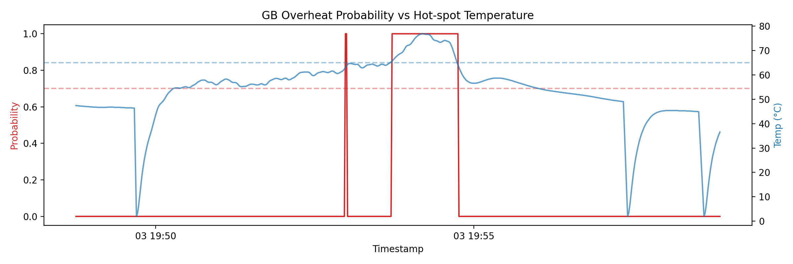
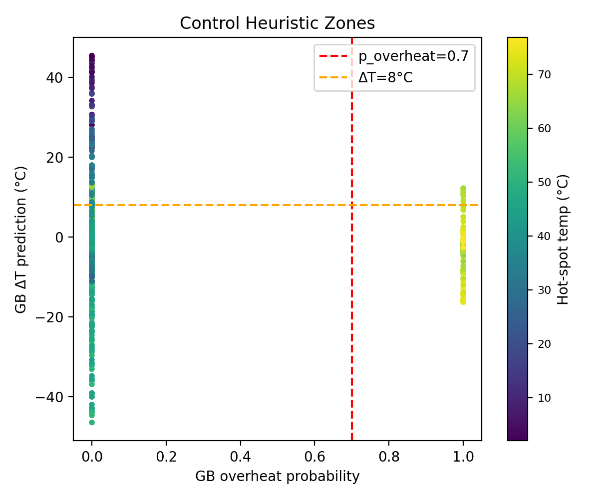

# DS3000 Battery Analyzer – Final Report

## 1. Executive Summary
- We built an early-warning system for inverter overheating using tree-based models with temporal features.
- Best classifier (overheat risk): Gradient Boosting, AUC **0.9995**, F1 (overheat) **0.9688**, recall **0.9841** on a chronological split.
- Best regressor (30 s ΔT): Gradient Boosting, MAE **1.307 °C**, RMSE **3.869 °C**.
- The control heuristic converts risk/ΔT into torque derates; validation shows **100% recall** on overheat seconds with ~15% overall derate rate. Precision is ~0.20, so thresholds can be tuned to reduce false derates if needed.
- Recommendation: deploy the advanced models + heuristic with monitoring and collect more diverse drive cycles to tune precision vs derate aggressiveness.

## 2. Data Pipeline & QA
- **Sources**: inverter temperatures, DC bus voltage/current, phase currents, optional torque/speed (in `data/`).
- **Cleaning/aggregation**: BOM-safe CSV loading, unit stripping, canonical snake_case headers, 1 Hz aggregation (mean/median), sorted timestamps. Implemented in `src/data_loading.py`, `src/aggregation.py`, merge in `src/scripts/data/merge_inverter_data.py`.
- **QA**: row-count checks, missing-rate tolerances, range validation via `src/scripts/data/qa_merged_data.py`; class balance and sensor sanity in `docs/class_balance_and_sensor_report.md`.
- **Commands**: `make data` → merged 1 Hz CSV; `make label` → labeled dataset `src/notebooks/clean/inverter_labeled_1hz.csv`.

## 3. Target Definition & Labels
- **Overheat label**: hot-spot temp exceeding configured threshold (see `src/labels.py`) on a chronological split.
- **ΔT target**: `delta_T_30s` = hot-spot temperature 30 s ahead minus current.
- Labels are generated in `src/labels.py` and used by all training/inference scripts.

## 4. Modeling
- **Baselines (Milestone 3)**:
  - Logistic regression (overheat): AUC **0.9938**, F1 (overheat) **0.588**, recall **0.984**; artifact `models/baseline/logreg_overheat.joblib`, metrics `metrics/logreg_metrics.json`.
  - Ridge regression (ΔT): MAE **4.669 °C**, RMSE **9.270 °C**; artifact `models/baseline/ridge_deltaT.joblib`, metrics `metrics/ridge_metrics.json`.
- **Advanced (Milestone 4)**:
  - Gradient Boosting classifier: AUC **0.9995**, F1 **0.9688**, recall **0.9841**; artifact `models/advanced/gb_overheat.joblib`, metrics `metrics/gb_overheat_metrics.json`.
  - Gradient Boosting regressor: MAE **1.307 °C**, RMSE **3.869 °C**; artifact `models/advanced/gbr_deltaT.joblib`, metrics `metrics/gbr_deltaT_metrics.json`.
  - Plots: see below for screenshots.
- **Validation**: chronological 80/20 split on 1 Hz labeled data, fixed seeds; temporal features from `add_temporal_features`.
- **QA thresholds**: `make advanced_qa` enforces AUC/F1/recall and MAE/RMSE minima/maxima.

## 5. Control Heuristic & Actions
- **Heuristic**: if `p_overheat > 0.9` or hot-spot temp > 65 °C → strong derate (~45%); if `p_overheat > 0.7` and `ΔT_pred > 8 °C` → mild derate (~25%); low-risk (<0.3 prob and <3 °C ΔT) → no derate; else moderate derate.
- **Control CLI**: `src/scripts/control/apply_control_heuristic.py` outputs `predictions/advanced/control_actions.csv` with suggested derate % and rationale.
- **Validation (`make advanced_qa` → control QA)**: derate_rate **0.149**, strong_rate **0.031**, derate recall on overheat **1.0**, derate precision **0.199**. Thresholds are configurable.
- **Future**: tune thresholds for higher precision, add ramping/slew limits, consider MPC/RL when more data is available.

## 6. Inference & Usage
- **Batch commands**:
  - Train: `make baseline`, `make advanced`.
  - QA + plots + control validation: `make advanced_qa`.
  - Inference + control: `make infer` (writes baseline/advanced predictions and control_actions CSV).
- **Inputs/outputs**: Input = labeled 1 Hz CSV (`src/notebooks/clean/inverter_labeled_1hz.csv`). Outputs: `predictions/overheat_predictions.csv`, `predictions/delta_predictions.csv`, `predictions/advanced/advanced_predictions.csv`, `predictions/advanced/control_actions.csv`.
- **Integration**: wrap `apply_control_heuristic.py` in a loop that feeds live telemetry; ensure temporal features are computed identically to training.

### Plots
Overheat probability vs temperature (advanced classifier):

Control regions (probability vs ΔT):

## 7. Reproducibility & CI
- Make targets: `baseline`, `advanced`, `infer`, `advanced_qa`, `test`, `clean`.
- CI: `.github/workflows/baseline.yml` runs train → advanced_qa (metrics, plots, control QA) → tests → infer on pushes/PRs, and uploads artifacts (metrics JSONs, advanced plots, control actions CSV).
- Environment: use `./venv` (Python 3.11+), dependencies in `requirements.txt`; PYTHONPATH is set via Make.

## 8. Findings & Recommendations
- Advanced models meet/exceed target recall/MAE; regression error improved vs. baseline (MAE from 4.67 °C to 1.31 °C).
- Control heuristic catches all labeled overheats on current data with modest derate rate; precision is low (~0.20), so tune thresholds if false-derates are costly.
- Recommendations:
  - Collect more varied drive cycles to calibrate precision thresholds and reduce unnecessary derates.
  - Add lightweight monitoring of AUC/F1/recall and derate rates in production; surface metrics JSON/plots as artifacts.
  - Explore smoother derate ramps and context-aware thresholds (ambient, coolant temp).

## 9. Appendix
- Data dictionary: `docs/data_dictionary.md`.
- Class balance and sensor notes: `docs/class_balance_and_sensor_report.md`.
- Metrics: `metrics/*.json` (baseline and advanced).
- Notebooks: `src/notebooks/01_eda_template.ipynb`, `02_baseline_modeling.ipynb`, `03_advanced_modeling.ipynb`.
